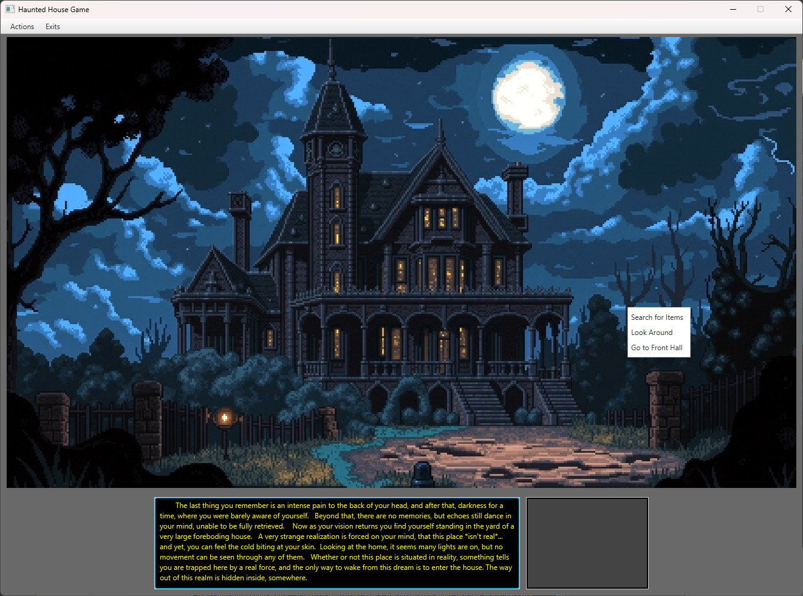
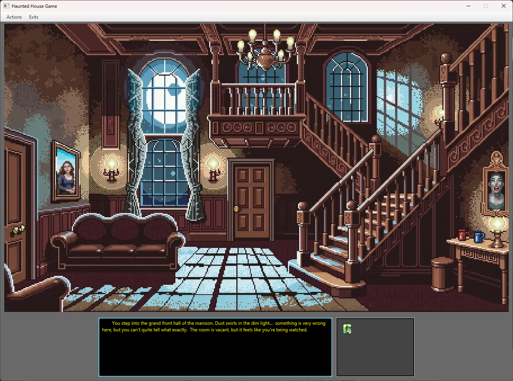

# Haunted House Game 

An atmospheric, text-and-graphic adventure game where players explore a haunted mansion, uncover hidden secrets, and search for a way to escape. 

The game was designed as a final project submission for Southwest Tech to demonstrate core object-oriented programming concepts, GUI development, and event handling in Java.

---

## The Setting & Gameplay
The player finds themselves suddenly trapped inside a living nightmare. The only way to break free and escape back to reality is to fully explore the shifting layout of the mansion, manage your inventory, and discover the specific items required to unlock your salvation.

## 👻 The Setting & Gameplay
The player finds themselves suddenly trapped inside a living nightmare. The only way to break free and escape back to reality is to fully explore the shifting layout of the mansion, manage your inventory, and discover the specific items required to unlock your salvation.

### 📦 Quick Start & Download

▶️ **[Click Here to Download Haunted House v3.0.0 (Windows)](PASTE_YOUR_LINK_HERE)**

1. **Download** and extract the `.zip` folder to your computer.
2. Open the extracted folder and navigate into `build/dist/HauntedHouse/`.
3. Double-click **`HauntedHouse.exe`** to launch the game instantly!

### 🎮 How to Play & Controls
You don't need to read the whole guide to get started! Control your exploration using either method:
* **Top Menu Bar:** Use the interactive buttons at the top of the window to change rooms, look around, or check your inventory.
* **Right-Click Menu:** Right-click anywhere inside the room view to open a dynamic context action menu for quick interactions.

### Game Previews
| Main Game Window | First Room Preview |
| :---: | :---: |
|  |  |

### How to Play - (Explained more fully)
The user interface is designed to give you fluid control over your exploration:
* **Top Menu Bar:** Use the interactive button options at the top of the window to move, search, and inspect.
* **Context Menu:** Right-click anywhere within the room view to pull up a dynamic context action menu.

### Core Features
- **Visual Immersion:** Dynamic room transitions paired with atmospheric, descriptive text updates.
- **Inventory Engine:** Fully functional system to collect, inspect, and deploy critical puzzle items.
- **Robust Input Handling:** Dual-control mechanics utilizing both top-level window menus and right-click context menus.
- **Pristine Build Pipeline:** Automated dependency management and packaging powered entirely by Gradle.

---

## Asset Credits
To build an eerie, immersive environment, the project combines modern AI generation with community assets:
* **Room Graphics:** High-quality pixel art landscapes generated via AI using **DALL-E 3** and **FLUX.1-dev**.
* **UI & Icons:** Free thematic icon sets sourced from creators on **itch.io**.

---

## 🛠️ Built With
* **Java 17** (Configured via Gradle Toolchain)
* **JavaFX 17.0.10** (Controls Module)
* **Gradle** (Build Automation Architecture)

---

## Getting Started & Building

Because this project is automated with Gradle, you do not need to manually install JavaFX on your system to run or edit the source code.

### Prerequisites
* **IDEs Supported:** VS Code (with the *Extension Pack for Java*) or IntelliJ IDEA.
* **Java:** A local installation of JDK 17.

### Running the Source Code
1. Clone or download this repository.
2. Open the root folder in your preferred IDE.
3. Allow the integrated Gradle wrapper a brief moment to automatically sync and pull the necessary JavaFX libraries.
4. Run the project through your IDE's Gradle tool window by executing the **`run`** task.

### Packaging a Standalone Windows Application
This project is configured to bypass strict modular JVM constraints using a native launcher pattern. To generate a fully self-contained desktop package that can be played on any computer:

1. Open the **Gradle Sidebar / Tool Window**.
2. Expand the `other` task group folder.
3. Double-click **`packageApp`**.
4. Once completed, your fully bundled application folder containing a standalone executable (`HauntedHouse.exe`) will be waiting in:
```text
   build/dist/HauntedHouse/


## 🚀 The Development Timeline
To see how this project evolved across different architectural stages, visit the other iterations in this progression index:
* **The Absolute Baseline:** [HauntedHouse-v1.0](https://github.com/c-stech-carter/HauntedHouse-v1.0) — The original prototype utilizing a bottom ComboBox menu system for navigation and native multimedia tracks driven straight out of Main.java.
* **The Current Milestone:** [HauntedHouse-v2.0](https://github.com/c-stech-carter/HauntedHouse-v2.0) — Introduces centralized GameWindow staging, a context-aware right-click menu system, interactive room searching, and an encapsulated inventory tracking system.
* **The Final Production Build:** [HauntedHouse-Release](https://github.com/c-stech-carter/HauntedHouse-Release) — Features complete project modernization with Gradle build automation, secure classpath resource mapping, and an optimized standalone bundle configuration.

***
